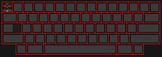

# Tamene Yilma 🚀

👋 **Welcome**

Finance professional and aspiring data analyst with a solid academic foundation in accounting and finance, and practical experience across financial operations and managerial roles. Skilled in financial reporting, budgeting, and data visualization.

---

## 🌐 Contact

- 📞 +251-913 3040 37  
- 📧 Tameneyilma911@gmail.com  
- 📍 Addis Ababa, Ethiopia  
- 🌍 [tamene24.github.io/tamene-portfolio](https://tamene24.github.io/tamene-portfolio)

---

## 📱 Social Media

  
  
  

---

## 🧠 Skills

- Analytical Thinking  
- Communication  
- Leadership  
- Team Collaboration  
- Problem-Solving  

---

## 🖥️ Technical & Data Analytics Skills

  
  
  
  
  

---

## 💼 Experience

**General Manager**  
*Nimaje Real Estate, Addis Ababa | 2024 – Present*  
- Oversaw financial, operational, and administrative functions  
- Led strategy, budgeting, and team supervision  
- Used data for decision-making and business growth

**Finance Officer**  
*SAEL Trade and Manufacturing, Addis Ababa | 2021 – 2023*  
- Managed financial reports, budgets, and audits  
- Conducted variance analysis and forecasting  
- Supported audits and improved internal finance processes  

---

## 🎓 Education

**MBA in Accounting and Finance**  
*St. Mary's University (2022 – 2025)* – GPA: 3.25/4.0

**BA in Accounting and Finance**  
*BST College (2019 – 2021)* – GPA: 3.62/4.0

---

## 📘 Key Courses

- Advanced Financial Accounting  
- Advanced Business Taxation  
- Advanced Cost Management Accounting  
- Financial Econometrics  

---

## 🗣️ Languages

- Amharic (Native)  
- Guragigna (Fluent)  
- English (Advanced)  
- Ge’ez (Liturgical / Religious Use)  

---

## 🎥 Portfolio Demo

  
*Add your portfolio demo GIF here for a dynamic preview!*

---

## 📄 CV

📥 [Download My CV](./Tamene_Yilma_CV_2025.pdf)

---

© 2025 Tamene Yilma. All rights reserved.

<!-- Trigger GitHub Actions for README.md -->
